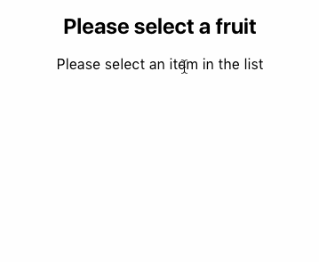

# WIP react-multiline-dropdown



## TODO
- tests
- improve style / how to override

## Installation
### npm
```
npm install react-multiline-dropdown
```
### yarn
```
yarn add react-multiline-dropdown
```

## Usage
```
import React, { Component } from 'react';
import { MultilineDropdown } from "react-multiline-dropdown"

const options = [
  { id: 1, title: "Simple Fruits", slug: "simple-fruits", summary: "Simple fruits may either be fleshy, like plums and peaches" },
  { id: 2, title: "Aggregate Fruits", slug: "aggregate-fruits", summary: "a fruit formed from several ovaries of one flower that produces many tiny fruits clustered tightly together." },
  { id: 3, title: "Multiple Fruits", slug: "multiple-fruits", summary: "a fruit formed from the fusion of the ovaries of many different flowers which develop closely together to form one bigger fruit." },
  { id: 4, title: "Accessory Fruits", slug: "accessory-fruits", summary: "are another kind of fruit that is not formed from the ovary, but from a different part of the flower." }
]

class App extends Component {
  render() {
    return (
      <div className="App">
        <form>
          <h2> Please select a fruit </h2>
          <MultilineDropdown options={options} handleSelect={this.handleSelect}/>
        </form>
      </div>
    );
  }
}

export default App;
```
